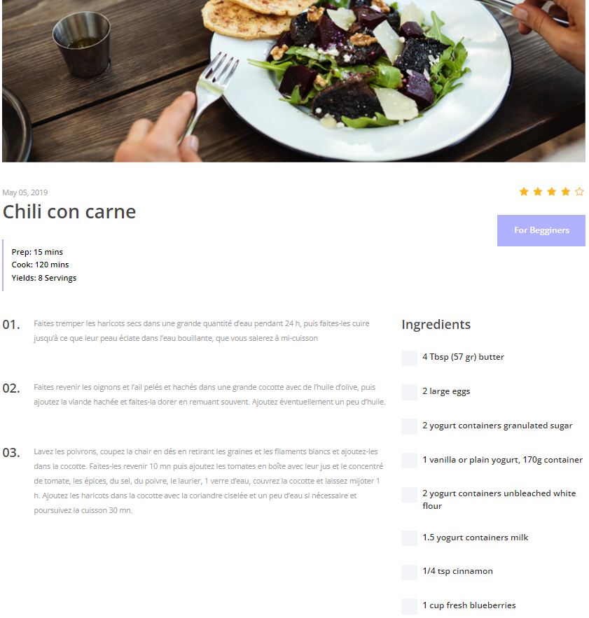

# " Site web de recettes de cuisine "

## Réaliser par :

**MAZZOUZ CHAIMAE**

**BOUTISSANTE ISSAM**

**EL BAHI SAAD**

## Fonctionnalités:

⚡️ Modèles : des modèles pour stocker les informations sur les recettes, les ingrédients,
      les commentaires et les notes.

⚡️ Vues : des vues pour afficher la page d'accueil, les pages des recettes, les pages des
      ingrédients, les pages des commentaires et les pages de profil.

## Page d'accueil:

## Page des recettes

## Page des ingrédients

## Page des commentaires

⚡ Authentification :

## Page de login

## Page de login 'False infos'

## Page de signup 

## Page de signup 'Email deja exist'

⚡ Web Scraping :  
 Nous avons utiliser un script de web scraping pour récupérer des informations sur les
recettes et les ingrédients à partir de sites de cuisine suivant : [website](https://www.elle.fr/Elle-a-Table/Recettes-de-cuisine) et les importer dans le site.
